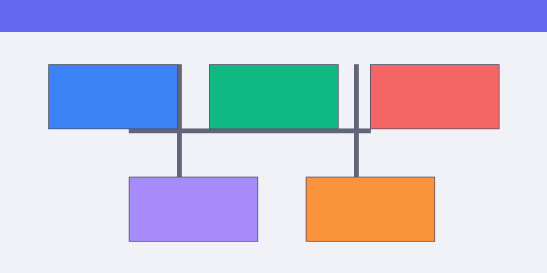

# Getting Started



This section walks you through everything you need to know to start using Product — from understanding the core concepts to configuring your first project.

## Overview

Product follows a **workspace → project → resource** hierarchy. Understanding this model makes the rest of the documentation much clearer.

```
Workspace
├── Project A
│   ├── Resources
│   └── Settings
└── Project B
    ├── Resources
    └── Settings
```

### Workspaces

A **workspace** is the top-level container for your organization. It holds all projects, members, and billing information. You typically have one workspace per company or team.

!!! info "Workspace limits"
    On the Starter plan, each workspace is limited to 5 members. Upgrade to Pro or Enterprise to add more collaborators.

### Projects

**Projects** are isolated environments within a workspace. Each project has its own:

- Configuration and environment variables
- Access control (invite specific members)
- Resource quotas
- Audit logs

### Resources

**Resources** are the actual entities within a project — datasets, pipelines, models, or any custom type registered via the plugin API.

---

## Core Concepts

### Authentication

Product uses token-based authentication. Every API call requires a bearer token:

```bash
curl -H "Authorization: Bearer <YOUR_TOKEN>" \
     https://api.example.com/v1/projects
```

Tokens are scoped to a workspace and can be restricted to specific permissions:

| Scope | Description |
|-------|-------------|
| `read` | Read-only access to all resources |
| `write` | Create and update resources |
| `admin` | Full control including member management |
| `billing` | Access to billing and usage data |

### Configuration File

Every project can include a `product.yml` configuration file at its root:

```yaml
version: "2"
project:
  name: my-project
  region: us-east-1

resources:
  - name: primary-dataset
    type: dataset
    source: s3://my-bucket/data/

  - name: inference-pipeline
    type: pipeline
    steps:
      - transform
      - validate
      - export

settings:
  retention_days: 30
  notifications:
    slack_webhook: ${SLACK_WEBHOOK_URL}
```

### Event System

Product emits events for every significant action. You can subscribe to events via webhooks or the streaming API:

```python
import product_sdk as product

client = product.Client(token="<YOUR_TOKEN>")

@client.on("resource.created")
def handle_created(event):
    print(f"New resource: {event.resource.name}")

@client.on("pipeline.failed")
def handle_failure(event):
    alert_team(event.error)

client.listen()
```

---

## Architecture

The diagram below shows how components interact at runtime:


### Data Flow

1. **Ingestion Layer** — accepts data from HTTP, message queues, or scheduled batch jobs
2. **Processing Engine** — applies transformations, validations, and enrichments
3. **Storage Layer** — persists results in columnar format with automatic indexing
4. **Query API** — exposes a SQL-compatible interface for downstream consumers

### Fault Tolerance

Each layer implements independent retry logic with exponential backoff. If the processing engine becomes unavailable, the ingestion layer buffers incoming data in a durable queue for up to 24 hours.

!!! warning "Data retention"
    Buffered data older than 24 hours is dropped by default. Configure `buffer.max_age` to increase this limit.

---

## Next Steps

- [Installation guide](installation.md) — install the CLI and SDK
- [Features overview](../features/index.md) — explore what Product can do
- [Video walkthrough](../features/video-demo.md) — see it in action
